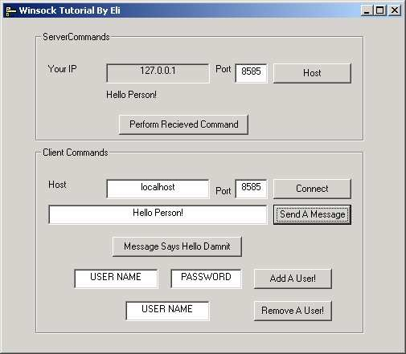



## Winsock Tutorial By Eli

### Description

This is meant for any VB user who wants to learn more about winsock. I'm a student at ITT tech (going for network administration) and I'm working on a project that will allow encrypted remote administration (including adding/removing users, mapping shared resources, and a whole bunch of other tasks that would be tedious if you were to go from machine to machine on a network).

Well, this is my first step! I'm very eager about making this product as useful as possible, so if ANYONE has ANY idea at ANY time about anything I should add (administration-wise) to this program, (as stripped down as it is) I would greatly appreciate it. In the works are:

Bulk administration

Gathering and sending system logs to the client.

Encryption. Might be tricky over the network.

A port scanner that saves reports in a database file and a comparison function to notify of new ports (helps weed out the backdoors!).

I'd *like* to add remote desktop viewing and control. However, does anyone know if this is even possible with VB???

I've also included a .txt tutorial on 'net' command that I posted on Astalavista.com, in case anyone wants to make one of these remote admin programs themselves *or* add more functionality to this one.

Let me know what you think!

You don't have to vote, since this is primarily for beginners, but if you must I'll accept anything under 6 globes.
 
### More Info
 

             |
---                |---
**Submitted On**   |2002-09-14 02:59:26
**By**             |[Eli P](https://github.com/Planet-Source-Code/PSCIndex/blob/master/ByAuthor/eli-p.md)
**Level**          |Beginner
**User Rating**    |5.0 (10 globes from 2 users)
**Compatibility**  |VB 5\.0, VB 6\.0
**Category**       |[Internet/ HTML](https://github.com/Planet-Source-Code/PSCIndex/blob/master/ByCategory/internet-html__1-34.md)
**World**          |[Visual Basic](https://github.com/Planet-Source-Code/PSCIndex/blob/master/ByWorld/visual-basic.md)
**Archive File**   |[Winsock\_Tu1309739142002\.zip](https://github.com/Planet-Source-Code/eli-p-winsock-tutorial-by-eli__1-38984/archive/master.zip)

